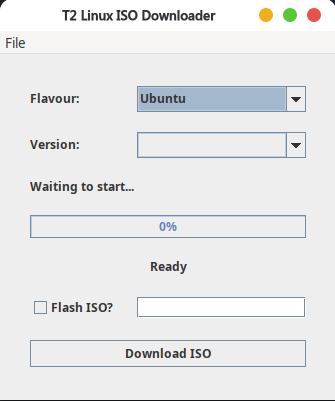

# T2ISO

T2ISO is a desktop ISO downloader and flasher focused on T2 Linux supported distributions.

## Screenshot



## Features

- Download All distros with all flavours supported by the T2 Community
- Resume/cancel download support
- SHA-256 checksum display after download
- Optional ISO flashing to a selected device path
- Build outputs for Linux AppImage and macOS `.app`

## Build

### Prerequisites

- JDK 25+
- Maven 3.9+
- Linux AppImage builds: `appimagetool`

### Package

```bash
mvn clean package
```

Outputs are generated in project root and `target/`.

This creates a release and uploads build artifacts.

## Native Image Metadata (Swing/AWT)

If native image fails at runtime with missing JNI classes/methods, regenerate metadata with the agent:

```bash
./native/generate-agent-config.sh
```

Then rebuild the native binary:

```bash
mvn -q -f native/pom_native.xml -DskipTests package
```

## Native Image Build Scripts

- Linux/macOS:
```bash
./make-native-image.sh
```

- Windows (PowerShell):
```powershell
.\make-native-image.ps1
```

- Windows (cmd.exe):
```bat
make-native-image.cmd
```

## Notes

- macOS icon is copied automatically from `packaging/macos/icon.icns` into `T2ISO.app/Contents/Resources/T2ISO.icns` during packaging on macOS.
